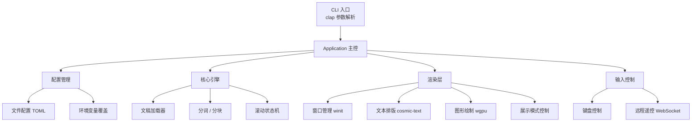
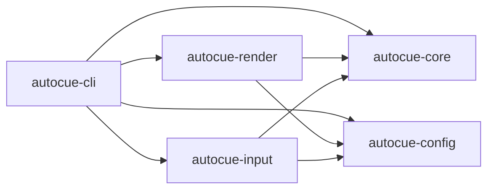
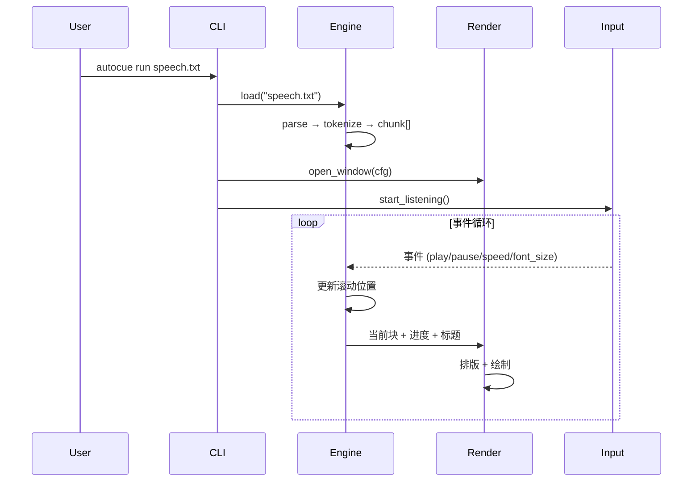
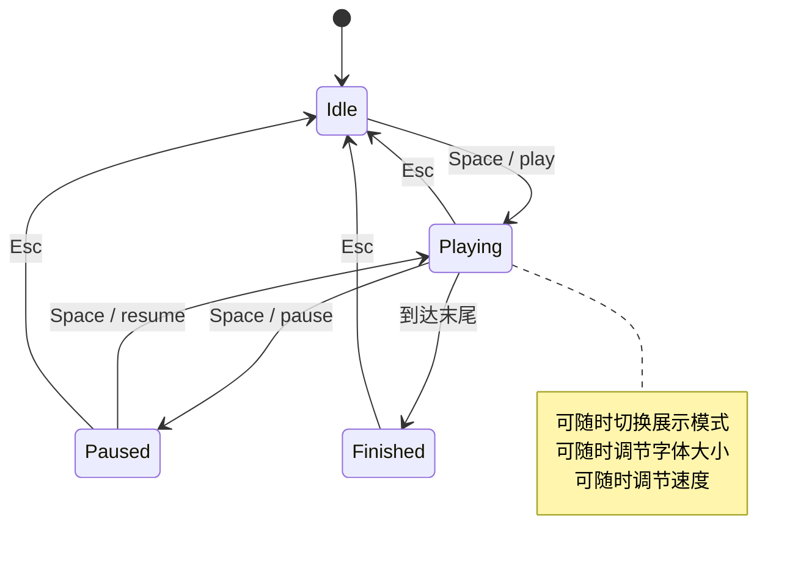

# VibeRustAutocue — 项目架构设计

> 一个基于 Rust 的屏幕提词器 (AutoCue / Teleprompter)，面向演讲、直播、视频录制等场景。

---

## 1. 系统总览



---

## 2. 分层架构

```
┌─────────────────────────────────────────┐
│               CLI Layer                  │
│  clap derive: 子命令、参数、验证          │
├─────────────────────────────────────────┤
│            Application Core              │
│  生命周期管理、模块编排、事件循环          │
├──────────────┬──────────────┬───────────┤
│    Engine     │   Render     │   Input   │
│  文稿加载     │  窗口+绘制   │  键盘/遥控 │
│  分词分块     │  展示模式    │  快捷键    │
│  滚动控制     │  标题叠加    │  WebSocket │
│  样式系统     │  字体缩放    │            │
├──────────────┴──────────────┴───────────┤
│            Infrastructure                │
│  Config (serde+TOML)  │  Logging (tracing) │
└─────────────────────────────────────────┘
```

---

## 3. Crate 拆分 (Workspace)

```
VibeRustAutocue/
├── Cargo.toml              # workspace root
├── crates/
│   ├── autocue-core/       # 核心引擎（无 GUI 依赖，不碰 GPU/窗口）
│   │   ├── src/
│   │   │   ├── lib.rs
│   │   │   ├── loader.rs       # 文稿加载 (txt, md, docx)
│   │   │   ├── clipboard.rs    # 剪贴板读取 (arboard)
│   │   │   ├── tokenizer.rs    # 分块 / 分词
│   │   │   ├── scroll.rs       # 滚动状态机
│   │   │   ├── script.rs       # 脚本数据结构
│   │   │   └── marker.rs       # 书签 / 标记点
│   │   └── Cargo.toml
│   │
│   ├── autocue-config/     # 配置层
│   │   ├── src/
│   │   │   ├── lib.rs
│   │   │   ├── defaults.rs
│   │   │   └── theme.rs        # 颜色 / 字体预设
│   │   └── Cargo.toml
│   │
│   ├── autocue-render/     # 渲染层 (winit + cosmic-text + wgpu)
│   │   ├── src/
│   │   │   ├── lib.rs
│   │   │   ├── window.rs       # winit 窗口封装
│   │   │   ├── painter.rs      # wgpu 绘制
│   │   │   ├── layout.rs       # cosmic-text 文本排版
│   │   │   ├── display.rs      # 展示模式调度 (scroll / chunk / focus)
│   │   │   ├── heading_bar.rs  # .md 标题栏叠加层
│   │   │   └── mirror.rs       # 镜像翻转
│   │   └── Cargo.toml
│   │
│   ├── autocue-input/      # 输入控制
│   │   ├── src/
│   │   │   ├── lib.rs
│   │   │   ├── keyboard.rs     # 全局快捷键
│   │   │   └── remote.rs       # WebSocket 远程控制
│   │   └── Cargo.toml
│   │
│   └── autocue-cli/        # 二进制入口
│       ├── src/
│       │   └── main.rs
│       └── Cargo.toml
```

### 依赖关系



- `autocue-core` 保持 **无平台/GUI 依赖**，可独立测试。
- `autocue-render` 和 `autocue-input` 各自是平台相关层（但都是纯 Rust 绑定）。
- `autocue-cli` 作为胶水层，组合所有 crate。

---

## 4. 核心数据流



### 文稿处理管线

```
原始文本 → [loader] → Script { paragraphs[], headings[] }
                   → [tokenizer] → Chunk { lines[], duration_estimate, heading }
                                 → [scroll] → 当前视口 Viewport
```

### 支持的文稿来源

| 来源 | 实现 | 说明 |
|------|------|------|
| `.txt` 文件 | 原生 `std::fs::read_to_string` | 纯文本，零依赖 |
| `.md` 文件 | 同上，额外解析 `#` / `##` 标题结构 | Markdown 结构感知 |
| `.docx` 文件 | `quick-xml` + ZIP 解析 | OOXML 格式，提取 `<w:p>` 段落 |
| 剪贴板粘贴 | `arboard` crate | 跨 Linux / macOS / Windows |
| stdin 管道 | `std::io::stdin().read_to_string()` | 适合 `echo "..." \| autocue run -` |

- `quick-xml` 和 `arboard` 都是纯 Rust 实现，不依赖 C 库。
- 所有来源最终归一化为 `Script` 结构，上层逻辑不关心来源。

### .md 标题追踪

对于 Markdown 文稿，loader 解析出 `# 一级标题` / `## 二级标题` 的层级结构。渲染时，当前所属章节的标题作为**半透明叠加条**显示在屏幕顶部，让演讲者始终知道自己讲到了哪个段落。

```
┌─────────────────────────────────────────┐
│  ## 第三章 · 系统架构      [标题叠加条]   │  ← 始终可见，半透明背景
├─────────────────────────────────────────┤
│                                         │
│  过去 3 年，我们在分布式系统领域           │
│  积累了超过 200 个生产案例……              │  ← 正文滚动区域
│                                         │
│  ████████████████████████████  ← 阅读线   │
│                                         │
└─────────────────────────────────────────┘
```

---

## 5. 展示模式

提词器提供三种展示模式，用户可在运行时通过按键实时切换。**匀速滚动是统一基线**，所有格式都支持。

### 5.1 三种模式对比

```
模式 A: 匀速滚动 (Smooth Scroll)
┌──────────────────────┐
│  ...上文逐渐淡出...    │
│  这是当前正在读的句子   │  ← 阅读线固定在视口 1/3 处
│  即将到来的下一句内容   │
│  再下一句...          │
│  ...下文渐入...       │
└──────────────────────┘
  文本匀速向上流动，速度 = 字/秒

模式 B: 逐块推进 (Chunk Advance)
┌──────────────────────┐
│                      │
│  整块内容一次显示     │  ← 填满整个视口
│  用户手动推进         │
│                      │
└──────────────────────┘
  一次显示一个"块"，按 → 或 Space 切到下一块

模式 C: 聚焦行 (Focus Line)
┌──────────────────────┐
│  上文 (灰色小字)       │
│  上文 (灰色小字)       │
│  ★ 当前行 (大字高亮) ★ │  ← 唯一聚焦行
│  下文 (灰色小字)       │
│  下文 (灰色小字)       │
└──────────────────────┘
  只突出显示当前一句话，其余弱化为辅助参考
```

| 特性 | 匀速滚动 | 逐块推进 | 聚焦行 |
|------|---------|---------|--------|
| 阅读线位置 | 视口 1/3 处 (可配) | 无 | 视口正中 |
| 推进方式 | 自动，按速度 | 手动按键 | 自动，按速度 |
| 上下文可见 | 前后各 2~3 句 | 整个块 | 前后各 3~4 行 (弱化) |
| 适用场景 | 演讲、直播 | 录制分段内容 | 朗诵、诗歌、提示 |
| 速度调节 | 实时调速 | N/A | 实时调速 |
| 标题叠加 | 始终可见 | 块顶部 | 始终可见 |

### 5.2 .md 文档的特殊处理

对于 `.md` 文件，**三种模式都支持**。额外提供：

- **标题叠加条**：屏幕顶部固定显示当前章节的 `## 标题`，半透明背景、比正文小一号字体。当滚动跨越标题边界时，叠加条即时更新。
- **标题导航**：`Ctrl+↑` / `Ctrl+↓` 跳到上一个/下一个标题段落。

对于 `.txt` 和剪贴板文本，标题叠加条不显示（因为没有结构），其余三种模式完全一致。

---

## 6. 渲染管线 — 大字显示方案

```
┌──────────┐    ┌──────────────┐    ┌────────────┐
│  Script   │───▶│ cosmic-text   │───▶│  wgpu       │
│  Chunk[]  │    │ Buffer +      │    │  Surface    │
│           │    │ Layout        │    │  + Shader   │
└──────────┘    └──────────────┘    └────────────┘
```

### 6.1 为什么是 cosmic-text

`cosmic-text` 做的是**文本塑形 + 排版**，不负责往屏幕上画像素。它解决的核心问题：

- **复杂文本塑形**：通过 `rustybuzz`（HarfBuzz 的 Rust 移植）处理连字、CJK 字间距、阿拉伯文变形等。
- **字体回退**：当主字体缺字时自动切换到后备字体。例如 Noto Sans 缺某个生僻汉字 → 自动切到 Noto Sans CJK。
- **高质量缩放**：字体本身就是矢量数据，放大到 300pt 不产生锯齿 — 改 `Attrs::font_size` 一行代码的事。
- **行断规则**：中文按字断行，英文按词断行，混合排版自动处理。
- **零系统依赖**：纯 Rust，不需要系统安装特定字体库；可以把 `.ttf` 打包进二进制。

`cosmic-text` 的输出是一组 **glyph 位置 + 纹理 atlas**，画到屏幕上是 `wgpu` 的工作。

### 6.2 字体大小调节

字体大小是提词器的核心体验参数。在 13 寸笔记本上可能需要 60pt 才能看清，接上外接显示器降到 32pt，上了提词器反射屏又需要 80pt+。

**可调范围**：`12pt ~ 300pt`，步进粒度 2pt。

| 控制方式 | 操作 | 粒度 |
|---------|------|------|
| 键盘微调 | `Ctrl+=` / `Ctrl+-` | ±2pt |
| 键盘粗调 | `Ctrl+Shift+=` / `Ctrl+Shift+-` | ±10pt |
| 键盘重置 | `Ctrl+0` | 回到配置默认值 |
| 鼠标滚轮 | `Ctrl+滚轮` | ±2pt |
| CLI 参数 | `--font-size 72` | 任意值 |
| 配置文件 | `display.font_size = 72` | 任意值 |

缩放实现：修改 `cosmic-text` 的 `Attrs::font_size` → 重新计算 layout → 重新生成 glyph atlas → 下一帧生效。整个过程在 ~2ms 内完成，无闪烁。

### 6.3 完整技术选型

| 层 | 首选 crate | 角色 |
|----|-----------|------|
| 窗口创建 | `winit` | 打开窗口、接收事件、获取帧 |
| 字体发现 | `fontdb` | 扫描系统字体目录 |
| 字体解析 | `ttf-parser` | 读取 TrueType/OpenType 文件 |
| 文本塑形 | `rustybuzz` (cosmic-text 内部) | HarfBuzz 算法 |
| 文本排版 | `cosmic-text` | 字形定位、行高、换行 |
| GPU 绘制 | `wgpu` | 把 glyph atlas 画到窗口 surface |
| 备选 (纯 CPU) | `softbuffer` | 不依赖 GPU，适合虚拟机/无 GPU 环境 |

### 6.4 镜像模式

提词器通常将画面左右翻转后投射到 45° 反射镜上。在 `wgpu` 的片元着色器中对 UV 坐标做一次 `u = 1.0 - u` 即可实现，无需额外依赖。

---

## 7. 跨平台策略 — 为什么 `cargo build` 即用

三个目标平台：**Linux、macOS、Windows**。选择 `winit` + `wgpu` + `cosmic-text` 这条栈，不是因为它们"功能最多"，而是因为它们在三个平台上**都走原生 API，且都是纯 Rust 或 Rust 绑定**：

```
┌──────────────────────────────────────────────────┐
│                   autocue-cli                     │
│               (纯 Rust，单二进制)                   │
├──────────────────────────────────────────────────┤
│  winit          │  wgpu             │ cosmic-text │
│  Linux: X11/    │  Linux: Vulkan    │  纯 Rust    │
│         Wayland │  macOS: Metal     │  零 C 依赖   │
│  macOS: AppKit  │  Windows: D3D12   │             │
│  Windows: Win32 │  备选: OpenGL     │             │
├──────────────────────────────────────────────────┤
│              平台原生 API (OS 自带)                 │
└──────────────────────────────────────────────────┘
```

### 各平台细节

| | Linux | macOS | Windows |
|----|-------|-------|---------|
| 窗口系统 | X11 / Wayland (winit 自动检测) | AppKit | Win32 |
| GPU 后端 | Vulkan (Mesa / 专有驱动) | Metal | Direct3D 12 |
| 字体路径 | `/usr/share/fonts/`, `~/.local/share/fonts/` | `/System/Library/Fonts/`, `~/Library/Fonts/` | `C:\Windows\Fonts\` |
| 剪贴板 | `arboard` → x11-clipboard / wayland-clipboard | `arboard` → AppKit NSPasteboard | `arboard` → Win32 Clipboard API |
| 编译依赖 | 仅需 Rust 工具链 + 系统 GPU 驱动 | 仅需 Rust 工具链 | 仅需 Rust 工具链 |

### 不选的方案及原因

| 方案 | 为什么不用 |
|------|-----------|
| `egui` | 提词器不需要按钮、列表、表单等 UI 控件；引入 egui 反而限制文本渲染质量和布局自由度 |
| `iced` | 同上，全功能 GUI 框架对于纯文本显示过重 |
| `tauri` (Web 技术) | 引入 Node.js / WebView 依赖；启动慢、内存占用高；三个平台上的 WebView 行为不一致 |
| `gtk-rs` | 需要系统安装 GTK 开发库；Windows 上配置痛苦；macOS 上外观非原生 |
| `qt` | C++ 编译依赖；交叉编译困难 |

这条栈 = **零 C++ 编译、零 JavaScript、零系统库安装**。用户只需 `cargo build --release`，出来的二进制直接运行。

---

## 8. 输入控制

### 8.1 默认键盘映射

#### 播放控制

| 按键 | 功能 |
|------|------|
| `Space` | 播放 / 暂停 |
| `Esc` | 退出 |

#### 导航

| 按键 | 功能 |
|------|------|
| `←` / `→` | 后退 / 前进一句 |
| `Ctrl+←` / `Ctrl+→` | 跳到上一个/下一个书签 |
| `Ctrl+↑` / `Ctrl+↓` | 跳到上一个/下一个标题 (仅 .md) |

#### 速度

| 按键 | 功能 |
|------|------|
| `↑` / `↓` | 加速 / 减速 10% |

#### 字体大小

| 按键 | 功能 |
|------|------|
| `Ctrl+=` | 字号 +2pt |
| `Ctrl+-` | 字号 -2pt |
| `Ctrl+Shift+=` | 字号 +10pt |
| `Ctrl+Shift+-` | 字号 -10pt |
| `Ctrl+0` | 字号重置为默认值 |
| `Ctrl+鼠标滚轮↑/↓` | 字号 ±2pt |

#### 展示模式

| 按键 | 功能 |
|------|------|
| `Ctrl+1` | 切换到匀速滚动模式 |
| `Ctrl+2` | 切换到逐块推进模式 |
| `Ctrl+3` | 切换到聚焦行模式 |

#### 窗口

| 按键 | 功能 |
|------|------|
| `F11` | 全屏切换 |
| `Ctrl+R` | 镜像模式切换 |

### 8.2 远程控制

- **WebSocket** 服务端 (内嵌于进程): 外部 app 通过 JSON 指令控制所有上述操作。
- 未来可选 OSC (Open Sound Control)，适用于专业演播室控制台。

---

## 9. 配置文件设计 (`autocue.toml`)

```toml
[window]
width = 800
height = 600
fullscreen = false
transparent = false

[display]
font_family = "Noto Sans CJK SC"
font_size = 48                     # 默认字号
font_size_min = 12                 # 可调下限
font_size_max = 300                # 可调上限
font_size_step = 2                 # 每次调节步长 (pt)
line_spacing = 1.5

# 展示模式: "scroll" | "chunk" | "focus"
default_mode = "scroll"

mirror = false                     # 镜像翻转
bg_color = "#000000"
fg_color = "#FFFFFF"
highlight_color = "#FFD700"        # 聚焦行/阅读线高亮

# 标题叠加条样式 (仅 .md)
[heading_bar]
enabled = true
font_size_ratio = 0.6              # 相对于正文字号的比例
bg_color = "#1a1a2e80"            # 半透明背景 (RGBA)
fg_color = "#a0a0c0"

[scroll]
default_speed = 5.0                # 字/秒
smooth = true
margin_top = 0.3                   # 阅读线位置 (0=顶部, 1=底部)

[input]
keyboard_shortcuts = true
websocket_enabled = false
websocket_bind = "127.0.0.1:9090"
```

---

## 10. CLI 命令设计

```bash
# 从文件加载（默认匀速滚动）
autocue run speech.txt

# 指定展示模式
autocue run speech.txt --mode chunk
autocue run script.md --mode focus

# 从剪贴板加载
autocue run --clipboard

# 从 stdin
cat speech.txt | autocue run -

# 完整参数
autocue run speech.txt \
    --speed 6.0 \
    --font-size 72 \
    --mode scroll \
    --mirror

# 生成默认配置
autocue init

# 校验文稿
autocue check speech.txt
```

---

## 11. 状态机



---

## 12. 路线图 (MVP → 完整版)

| 阶段 | 内容 | 里程碑 |
|------|------|--------|
| **Phase 0** | 项目骨架: workspace、crate 拆分、CI | `cargo build` 通过 |
| **Phase 1** | `autocue-core`: loader (txt/md/docx) + clipboard + tokenizer + scroll | 单元测试全部通过 |
| **Phase 2** | `autocue-render`: winit 窗口 + cosmic-text 排版 + wgpu 绘制 + 字体缩放 | 能显示静态大字，Ctrl+=/- 生效 |
| **Phase 3** | 匀速滚动模式 + 键盘控制 + 标题叠加条 | 可用的基础提词器 |
| **Phase 4** | 逐块推进 + 聚焦行模式、镜像模式、配置文件 | 三种展示模式完备 |
| **Phase 5** | 远程控制 (WebSocket)、剪贴板粘贴、docx 解析 | 多来源输入完备 |
| **Phase 6** | Linux / macOS / Windows 三平台测试 + 打包 | 发布 0.1.0 |

---

> 本架构文档随项目演进持续更新。当前版本: **draft v0.3**
